# 🌌 Eidolon v2

> **A GitHub-native digital identity system that evolves a procedural creature based on your real GitHub activity.**

Eidolon is composed of two independent engines: a **Stats Engine** that collects your coding data, and an **Evolution Engine** that procedurally generates a unique, evolving creature. Your creature's form, aura, and complexity are directly tied to your EXP, Level, and Programming Languages.

---

## 🚀 Live Status

<p align="center">
  
</p>


*Your creature and badge evolve daily based on your GitHub contributions.*

---

## ✨ Features

- **Stats Engine:** Automatically aggregates commits, repositories, and language usage.
- **Evolution Engine:** Uses a seeded, deterministic algorithm to generate a unique creature for every user.
- **Procedural Graphics:** Renders a layer-based SVG creature that changes form as you level up.
- **Mythic Types:** Maps your top programming languages to elemental types (e.g., Python → Arcane, Rust → Iron).
- **Fully Automated:** Runs entirely on GitHub Actions with no external servers or databases.

---

## 🧬 Evolution Mechanics

### The Core Loop
1. **Activity:** You push code to GitHub.
2. **Stats:** The system calculates your EXP and determines your primary/secondary types.
3. **Evolution:** The engine generates a new creature form based on your current stats.
4. **Publication:** Your profile badge and creature SVG are updated automatically.

### Evolution Stages
Your creature evolves through distinct forms as you gain levels:

| Level Range | Stage          | Description                                  |
| :---------- | :------------- | :------------------------------------------- |
| 0           | **Egg**        | The dormant potential of a new identity.     |
| 1 – 10      | **Awakened**   | A simple, geometric lifeform emerges.        |
| 11 – 25     | **Ascendant**  | A complex, multi-limbed entity takes shape.  |
| 26+         | **Transcendent**| A being of pure energy and complexity.       |

### Mythic Types (Language DNA)
Your primary and secondary types determine your creature's color palette and mutations:

| Language   | Type       | Color Theme |
| :--------- | :--------- | :---------- |
| Python     | **Arcane** | 🟣 Purple   |
| JavaScript | **Volt**   | 🟡 Yellow   |
| TypeScript | **Lumina** | 🟢 Green    |
| Rust       | **Iron**   | 🔘 Gray     |
| Go         | **Aether** | 🔵 Blue     |
| C++        | **Draconis**| 🔴 Red      |

---

## 🛠️ Tech Stack & Architecture

- **Runtime:** Node.js 20
- **Languages:** JavaScript (ES Modules)
- **CI/CD:** GitHub Actions (Daily Cron)
- **Data:** JSON (Stateless, Git-backed persistence)

### Project Structure
- `scripts/`: Data fetching and orchestration logic.
- `engine/`: The core Evolution Engine and SVG Renderer.
- `data/`: JSON storage for stats and creature parameters.
- `public/`: Generated assets (dashboard, SVGs).

---

## ⚙️ Setup & Development

To run the engine locally:

```bash
# 1. Install dependencies
npm install

# 2. update Data (Fetch latest GitHub stats)
# Requires GITHUB_TOKEN in .env or environment
npm run update

# 3. Evolve Creature (Generate new form based on stats)
npm run evolve

# 4. Generate Badge
npm run badge
```

---

## 🗺️ Roadmap (v2)
- [x] Stats Engine (EXP, Level, Type Calculation)
- [x] Evolution Engine (Seeded Variation & Morphologies)
- [x] Procedural SVG Renderer
- [x] Automated GitHub Action Workflow
- [x] Static Dashboard Integration

---

Built with ❤️ by [Zypheris Labs](https://github.com/zypherison)
